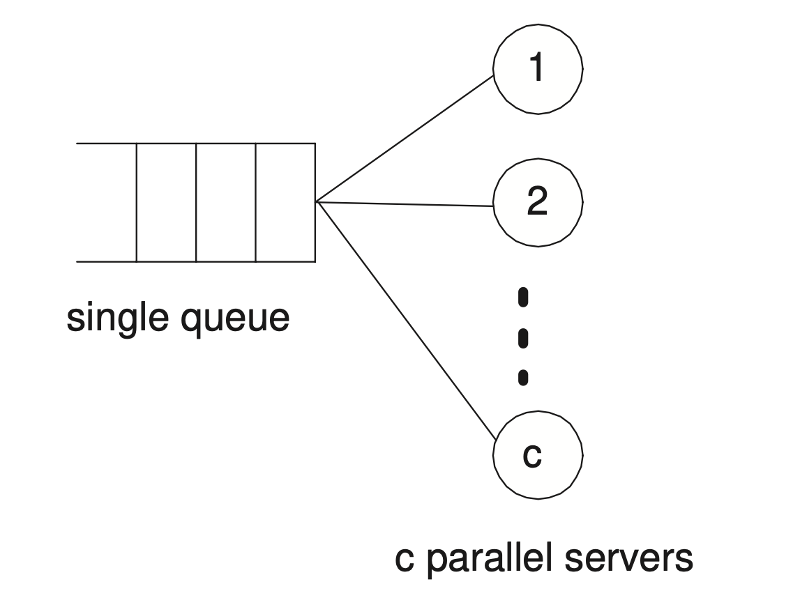
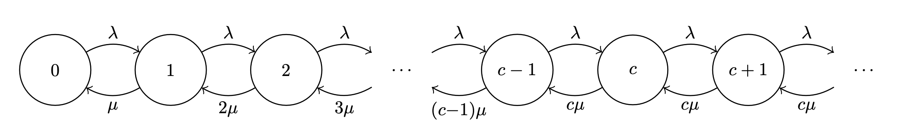

# Multiple Parallel Servers \\( M/M/c \\) Queue

Consider a system with the following:

- A Poisson arrival process.
- Exponentially distributed service times.
- \\( c \\) parallel servers.
- First-come first-served scheduling.

A queue like this can be modelled via the following CTMC:

with a constant arrival rate \\( \\lambda_n = \\lambda \\) for all states \\( n \\ge 0 \\) and a service rate that depends on the current queue population \\( n \\):

\\[
\\begin{align}
\\mu_n &= \\min(n, c) * \\mu \\\\
       &= \\begin{cases}
n \\mu & 1 \\le n \\le c - 1 \\\\
c \\mu & n \\ge c
\\end{cases}
\\end{align}
\\]

This means that when the queue population is less than the number of servers \\( c \\), the service rate increases linearly with the number of jobs, and once it exceeds this number it behaves like an \\( M/M/1 \\) queue with a fixed service rate of \\( c \\mu \\).

## Balance Equations

The balance equations for this model are the following:

\\[
\\begin{align}
\\lambda p_0 &= \\mu p_1 \\\\
(\\lambda + n \\mu) p_n &= \\lambda p_{n-1} + (n + 1) \\mu p_{n+1} & 1 \\le n \\le c - 1 \\\\
(\\lambda + c \\mu) p_n &= \\lambda p_{n-1} + c \\mu p_{n+1} & n \\ge c
\\end{align}
\\]

Applying the state-dependent \\( M/M/1 \\) formulas we get:

\\[
\\begin{align}
p_n &= p_0 \\prod_{i=1}^n {\\lambda \\over \\mu_i} \\\\
    &= \\begin{cases}
p_0 {\\rho^n \\over n!} & 0 \\le n \\le c - 1 \\\\
p_0 {\\rho^n \\over c! c^{n-c}} & n \\ge c
\\end{cases}
\\end{align}
\\]

where \\( \\rho = \\lambda / \\mu \\). Note that the denominators come from \\( \\mu_n = \\min(n,c) * \\mu \\), which means:

\\[
\\mu_1 = \\mu \\quad \\mu_2 = 2 \\mu \\quad \\dots \\quad \\mu_{c} = c \\mu \\quad \\mu_{c+1} = c \\mu \\quad \\dots
\\]

so when they are multiplied together in a product we get:

\\[
\\begin{align}
\\prod_{i=1}^n \\mu_i &= \\left[ (1 \\mu) (2 \\mu) \\dots ((c-1) \\mu) (c \\mu) \\right] * \\left[ (c \\mu) \\dots (c \\mu) \\right] \\\\
&= (c! \\mu^c) * (c^{n-c} \\mu^{n-c}) \\\\
&= c! c^{n-c} \\mu_n
\\end{align}
\\]

Again, we can get \\( p_0 \\) by using the normalising condition:

\\[
p_0 = {1 \\over 1 + \\sum_{n=1}^{c-1} {\\rho^n \\over n!} + {\\rho^c \\over (c-1)!(c-\\rho)}}
\\]

## Performance Indicies

### Average Number of Busy Servers \\( B \\)

The average number of busy servers \\( B \\) is given by:

\\[
\\begin{align}
B &= \\sum_{k=1}^{c-1} k p_k + c \\sum_{k=c}^\\infty p_k \\\\
  &= \\dots \\\\
  &= \\rho
\\end{align}
\\]

If the system is in a steady state, then the arrival rate \\( \\lambda \\) should be equal to the average throughput \\( B \\mu \\), so \\( B \\mu = \\lambda \\) which means that \\(B = \\lambda / \\mu = \\rho \\) which satisfies the equation above.

### Utilisation \\( U \\)

The utilisation \\( U \\) is the fraction of servers that are being used, which is given by:

\\[
U = {B \\over c} = {\\rho \\over c}
\\]
