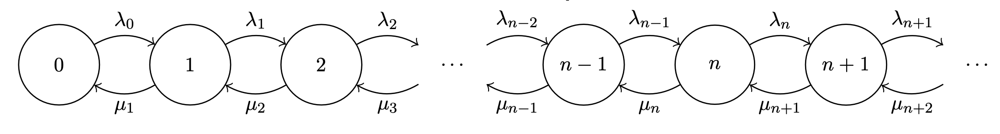

# State-dependent M/M/1 Queue

Consider a queue where the arival and service rates depend on the size of the queue:

This model has the following balance equations:

\\[
\\begin{align}
\\lambda_0 p_0 &= \\mu p_1 \\\\
(\\lambda_n + \\mu_n) p_n &= \\lambda_{n-1} p_{n-1} + \\mu_{n+1} p_{n+1}, \\quad n \\gt 0
\\end{align}
\\]

Using a similar derivation to the standard \\( M/M/1 \\) queue we get:

\\[
\\begin{align}
\\mu_2 p_2 &= \\lambda_1 p_1 \\\\
p_2 &= {\\lambda_1 \\over \\mu_2} p_1 \\\\
    &= {\\lambda_0 \\lambda_1 \\over \\mu_1 \\mu_2} p_0 \\\\
p_n &= {\\lambda_0 \\dots \\lambda_{n-1} \\over \\mu_1 \\dots \\mu_n} p_0 \\\\
    &= p_0 \\prod_{k=0}^{n-1} {\\lambda_k \\over \\mu_{k+1}}
\\end{align}
\\]

and applying the normalisation condition to calculate \\( p_0 \\):

\\[
\\begin{align}
\\sum_{n=0}^\\infty p_n &= 1 \\\\
p_0 + \\sum_{n=1}^\\infty p_0 \\prod_{k=0}^{n-1} {\lambda_k \\over \\mu_{k+1}} &= 1 \\\\
p_0 + p_0 \\sum_{n=1}^\\infty \\prod_{k=0}^{n-1} {\lambda_k \\over \\mu_{k+1}} &= 1 \\\\
p_0 &= {1 \\over 1 + \\sum_{n=1}^\\infty \\prod_{k=0}^{n-1} {\\lambda_k \\over \\mu_{k+1}} }
\\end{align}
\\]
