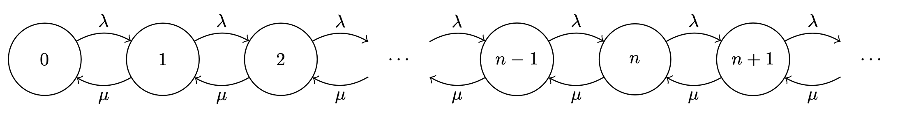

# The \\( M/M/1 \\) Queue

This is the simplest Markovian queue, and it can be modelled by a CTMC with the following state transition graph:

This CTMC has the following balance equations:

\\[
\\begin{align}
\\lambda p_0 &= \\mu p_1 \\\\
(\\lambda + \\mu) p_n &= \\lambda p_{n-1} + \\mu p_{n+1}, \\quad n \\gt 0
\\end{align}
\\]

where the top equation is for the edge case state \\( 0 \\), and the bottom equation is for every other state with two states either side of it.

