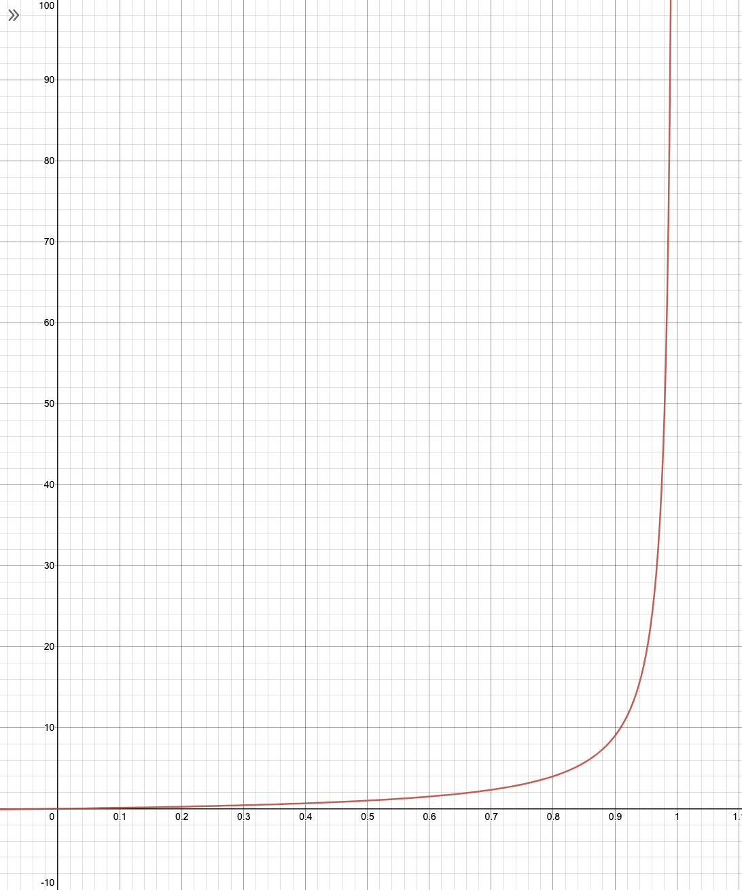
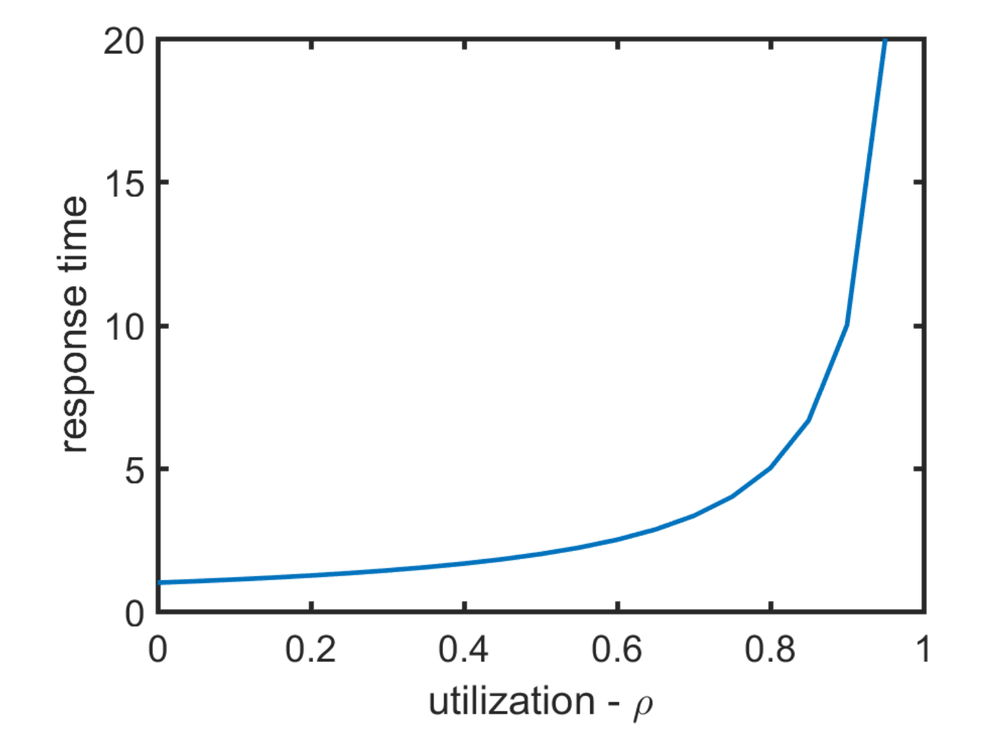

# Performance Indicies

Using the previous results, we can calculate some performance indicies.

### Throughtput \\( X \\)

When in state \\( 0 \\) the throughput is \\( 0 \\), and when in state \\( n \\gt 0 \\) the throughput is \\( \\mu \\).

\\[
\\begin{align}
X &= p_0 * 0 + (1 - p_0) * \\mu \\\\
  &= \\rho \\mu \\\\
  &= \\lambda
\\end{align}
\\]

### Server Utilisation \\( U \\)

The server is idle when \\( n = 0 \\), and is busy otherwise.

\\[
\\begin{align}
U &= 1 - p_0 \\\\
  &= \\rho
\\end{align}
\\]

### Mean Queue-length \\( N \\)

The population is a geometrically distributed random variable with parameter \\( \\rho \\) (see [here](#finding--p_n-)), so the mean population/queue-length is:

\\[
\\begin{align}
N &= \\sum_{n=0}^{\\infty} n p_n \\\\
  &= {\\rho \\over 1 - \\rho} \\\\
\\end{align}
\\]

Notice how this graph has an asymptote at \\( \\rho = 1 \\).

### Mean Response Time \\( R \\)

Remember that the response time is equal to the mean time that a job spends inside the system (queueing time + service time). It can be found using [Little's Law](/operational-laws/littles-law.html):

\\[
\\begin{align}
R &= {N \\over \\lambda} \\\\
  &= {1 / \\mu \\over 1 - \\rho} \\\\
  &= {1 \\over \\mu - \\lambda}
\\end{align}
\\]

### Mean Number Of Customers Waiting To Be Served \\( N_Q \\)

On average, there are \\( \\rho \\) customers being served. Therefore, the number of customers waiting to be served is equal to:

\\[
\\begin{align}
N_Q &= N - \\rho \\\\
    &= {\\rho \\over 1 - \\rho} - \\rho \\\\
    &= {\\rho - (1 - \\rho) \\rho \\over 1 - \\rho} \\\\
    &= {\\rho^2 \\over 1 - \\rho}
\\end{align}
\\]

## Response Time "Knee"

The point \\( \\rho = 0.7 \\) is conventionally regarded as the "knee" point of this curve. If a system is above this point, it is considered to be under **heavy-load**.
