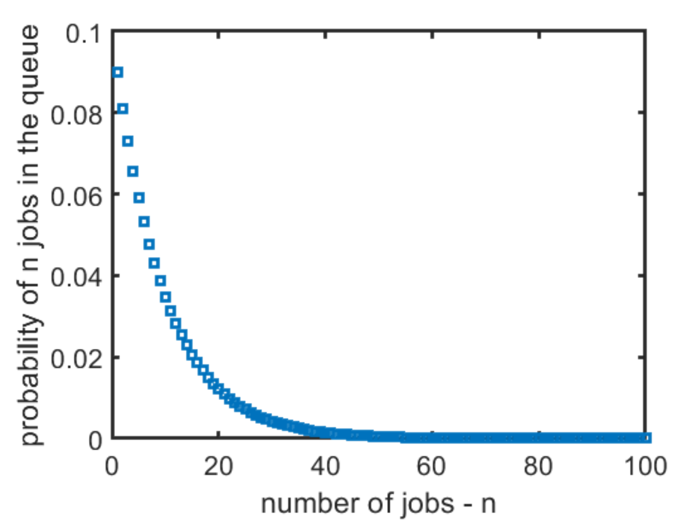

# Steady-state Distribution

A "analytical", or "closed-form", solution can be found by inspection. For state \\( 1 \\) we get:

\\[
\\begin{align}
\\mu p_1 &= \\lambda p_0 \\\\
p_1 &= {\\lambda \\over \\mu} p_0 \\\\
    &= \\rho p_0
\\end{align}
\\]

where \\( \\rho = {\\lambda \\over \\mu} \\). This result can be used to solve state \\( 2 \\):

\\[
\\begin{align}
(\\lambda + \\mu) p_1 &= \\lambda p_0 + \\mu p_2 \\\\
\\lambda p_1 + \\mu p_1 &= \\mu p_1 + \\mu p_2 \\\\
\\lambda p_1 &= \\mu p_2 \\\\
p_2 &= \\rho p_1 \\\\
    &= \\rho^2 p_0 \\\\
\\end{align}
\\]

Remember that \\( \\lambda p_0 = \\mu p_1 \\). We can see that this is following a trend, so for any state \\( n, 0 \\le n \\) we get:

\\[
p_n = \\rho^n p_0
\\]

which turns out to be the exact solution. This can be proven formally by using induction, or by showing that it satisfies the balance equations.

## Finding \\( p_0 \\)

To find \\( p_0 \\), we can use the normalising equation:

\\[
\\sum_{n = 0}^{\\infty} p_n = \\sum_{n = 0}^{\\infty} \\rho^n p_0 = 1
\\]

which is rearranged to:

\\[
p_0 = \\left[ \\, \\sum_{n = 0}^{\\infty} \\rho^n \\right]^{-1} = 1 - \\rho
\\]

Note that this sum only converges if \\( \\rho \\lt 1 \\) which is true only when \\( \\lambda \\lt \\mu \\), hence the a system with \\( \\lambda = \\mu \\) has no solution and is **unstable**.

## Finding \\( p_n \\)

By substituting the result \\( p_0 = 1 - \\rho \\) back into the equation for \\( p_n \\), we get:

\\[
p_n = (1 - \\rho) \\rho^n, \\quad n \\ge 0
\\]

which means that the probability of being in a state \\( n \\) geometrically decays as \\( n \\) increases:

Note in this graph \\( \\rho = 0.8 \\).
