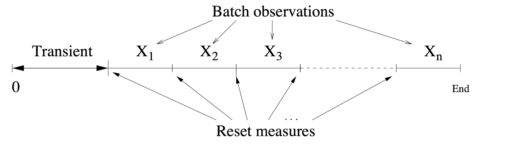
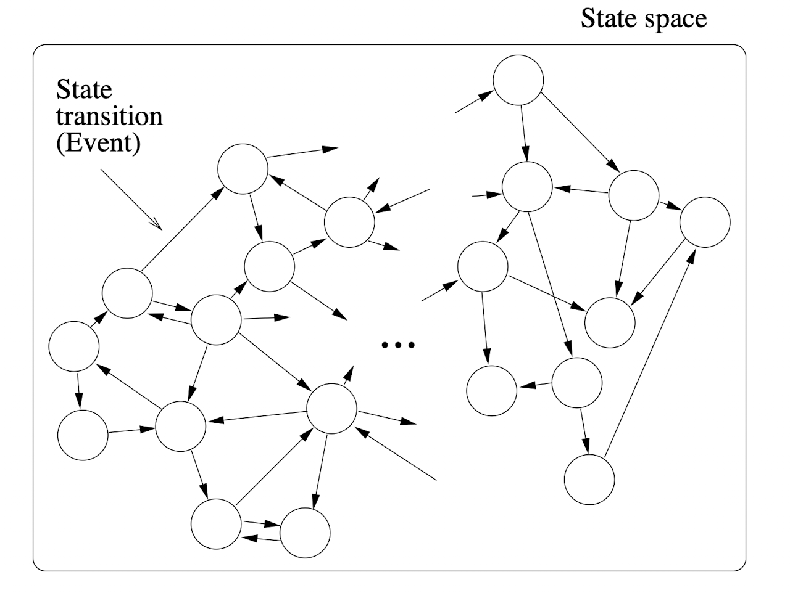
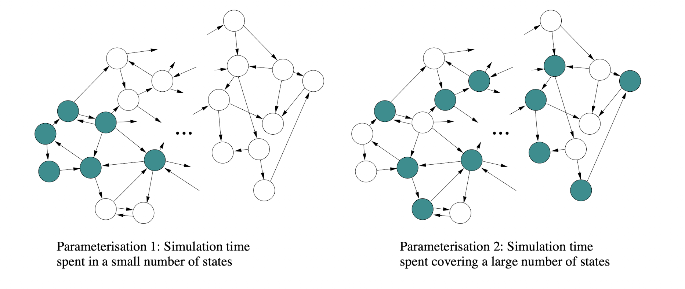

# Confidence Intervals

Given \\( n \\) observations \\( X_i, 1 \\le i \\le n \\) for an unknown mean \\( \\mu \\), the \\( 100 \\alpha \\% \\) confidence interval for \\( \\mu \\) is given by:

\\[
\\overline{X} \\pm {t_{n - 1, 1 - \\alpha / 2} * S \\over \\sqrt{n}}
\\]

where \\( t_{n - 1, 1 - \\alpha / 2} \\) is the result given by the t-distribution with \\( n-1 \\) degrees of freedom and a tail area of \\( 1 - \\alpha / 2 \\). This confidence interval is **exact** (not an **approximation**) if:

\\[
P \\left( \\overline{X} - {t_{n - 1, 1 - \\alpha / 2} * S \\over \\sqrt{n}} \\le \\mu \\le \\overline{X} + {t_{n - 1, 1 - \\alpha / 2} * S \\over \\sqrt{n}} \\right) = \\alpha
\\]

In practice, the confidence interval is typically an **approximate** because of one or more of the following reasons:

- \\( n \\) is too small (note that being too "small" depends on the distribution of the measurements).
- \\( n \\) is small and the measurements \\( X_i \\) are not normally distributed.
- The measurements \\( X_i \\) are not independent of each other.

## Independent Measuring

To ensure that the measurements \\( X_i \\) are made independently, they can be made by running \\( n \\) **independent replications** (simulations).

Another method would be to run a single simulation to the point of (approximate) equilibrium, running back-to-back fixed time batches of measurements, resetting the measurements made at the end of each epoch:

where measurement \\( X_i \\) is the measurement made from batch \\( i \\). If \\( X_i \\) is also a mean, then this is called the **batched means** method. However, an issue with this method is that sequential measurements \\( X_i \\) and \\( X_{i + 1} \\) may be dependent if the simulation enters some edge case state.

## Dealing with Dependent Measurements

If the measurements \\( X_i \\) are dependent, then the **covariances** must be taken into account to build an exact confidence interval. Looking back at the previous confidence interval, this makes the following assumption:

\\[
VAR \\left( \\overline{X} \\right) = {\\sigma^2 \\over n} + {1 \\over n^2} \\left[ 2 \\sum_{i=1}^{n-1} \\sum_{j=i+1}^{n} Cov(X_i, X_j) \\right]
\\]

Since covariances are typically positive, then the variance estimate \\( S^2 \\over n \\) will become an **under-estimate** of the actual variance \\( VAR \\left( \\overline{X} \\right) \\). This means that the computed confidence intervals are narrower than they should be.

## Bounding the Error from Simulations

The simulaton run length and/or number of observations collected could be adjusted to make the confidence interval half width less than or equal to some small percentage of the sample mean. That is:

\\[
h \\le c \\overline{X}
\\]

where:

- \\( h \\) is the confidence interval half width of the collected data.
- \\( c \\) is some fixed small percentage.

This is done by:

1. Fixing \\( c \\) to the desired accuracy level, for example \\( 10 \\% \\).
2. Run the simulation to obtain \\( n \\) independent (and if \\( n \\) is small, approximately normally-distributed) observations \\( X_1, X_2, ... , X_n \\).
3. Compute \\( \\overline{X} \\) and \\( S \\), then use these values to compute the half width of the \\(100 \\alpha \\% \\) confidence interval \\( h \\):

\\[
h = {t_{n - 1,1 - \\alpha / 2} * S \\over \\sqrt{n}}
\\]

4. If \\( h \\gt c \\overline{X} \\) then increase the observation period and/or the number of replications (independent simulations) and repeat the experiment.

Since this is a feedback loop until a certain threshold is reached, this process can clearly be automated.

## State Space Coverage

Take some arbitrary model and consider its underlying state space/transition system:

Assume that a simulation for this model is run for time \\( T \\) at (approximate) equilibrium and for every state \\( s \\) the time spent in state \\( s \\) is \\( T_s \\). This can be used to approximate the probability \\( p_s \\) of being in state \\( s \\):

\\[
\\hat{p}_s = {T_s \\over T}
\\]

Note that measures such as the waiting time \\( W \\) can either be calculated directly or in terms of \\( \\hat{p}_s \\) using Little's Law; the answers will be the same.

The quality of the estimate \\( \\hat{p}_s \\) clearly depends on \\( T \\), but it also depends on the distribution of \\( p_s \\) where \\( s \\in S \\):

In this diagram, the coloured states are the largest subset of states \\( S' \\subseteq S \\) such that:

\\[
inf \\{ p_i | i \\in S' \\} \\ge sup \\{ p_j | j \\in S - S' \\}
\\]

and 

\\[
\\sum_{i \\in S'} p_i \\le p_{max}
\\]

for some \\( p_{max} \\). These two equations simply split the states into two sets, where \\( S' \\) contains the highest probability states and \\( S - S' \\) contains the lowest probability states, and this split is defined by the parameter \\( p_{max} \\).

The left model shows a system under light load, whereas the right model show a system under heavy load. The confidence interval for the left model will be narrower than the right.
