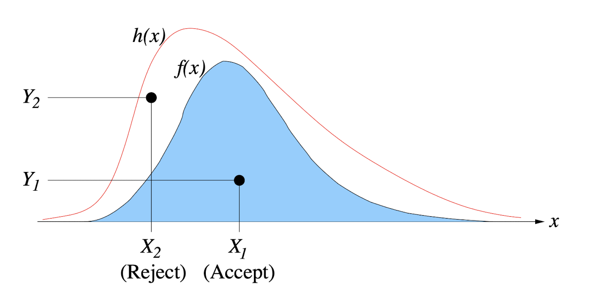
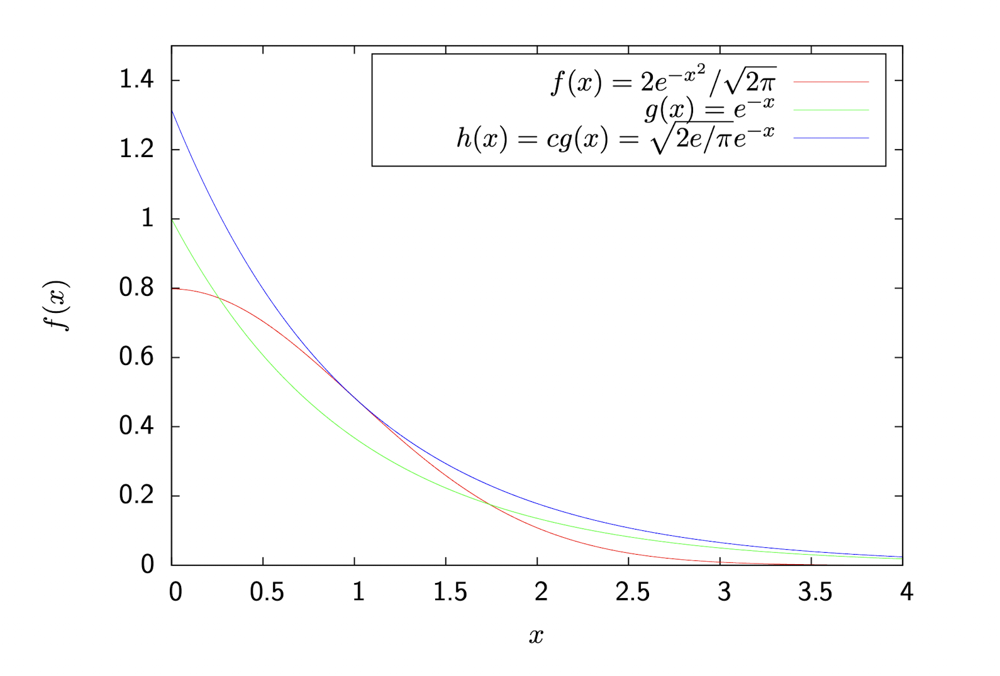
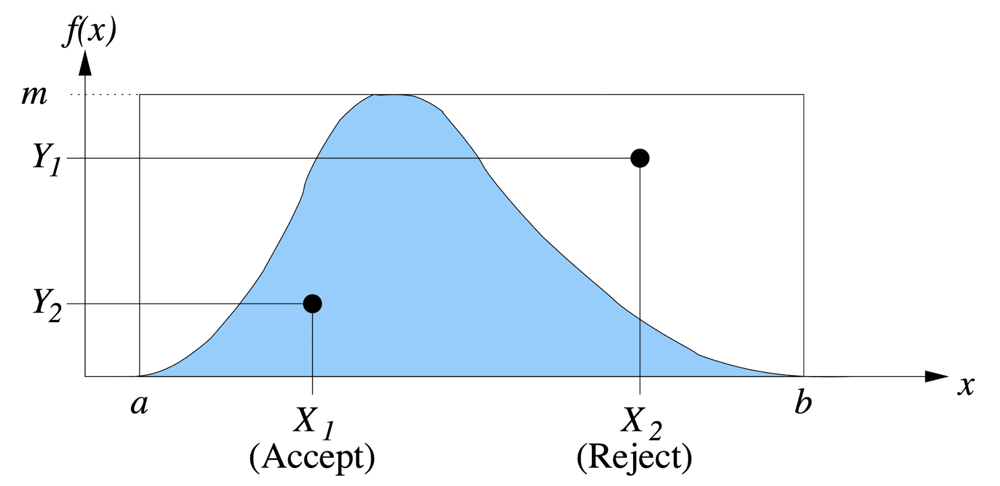

# Acceptance-Rejection (AR) Method

If the c.d.f \\( F(x) \\) cannot be inverted then we can sometimes use the p.d.f \\( f(x) \\) instead.

Firstly, find a function \\( h(x) \\) which **dominates** \\( f(x) \\), meaning \\( h(x) \\ge f(x) \\) for all \\( x \\). Then generate a density function \\( g(x) \\) by "normalising" \\( h(x) \\) so that the area under \\( g(x) \\) is equal to \\( 1 \\):

\\[
\\int_x h(x) dx = c \\implies g(x) = {h(x) \\over c}
\\]

Thus, the c.d.f is given by:

\\[
\\begin{align}
G(x) &= \\int_{-\\infty}^{x} g(t)dt \\\\
     &= \\int_{-\\infty}^{x} {h(t) \\over c} dt
\\end{align}
\\]

\\( g(x) \\) and/or \\( G(x) \\) need to be easy to sample for this method to work.

An alternative method is starting with some p.d.f \\( g(x) \\) and scaling it by a factor \\( c \\) to get a function \\( h(x) \\) which dominates \\( f(x) \\):

\\[
\\begin{align}
c &= c \\int_x g(x) dx \\\\
  &= \\int_x h(x) dx
\\end{align}
\\]

## AR Algorithm

1. Let \\( X \\) be a sample from \\( g(x) \\) or \\( G(x) \\).
2. Let \\( U \\) be a sample from the \\( U(0, 1) \\) distribution and let \\( Y = U * h(X) \\).
3. If \\( Y \\le f(X) \\) then **accept** \\( X \\), otherwise **reject** it and start over.

Note that \\( Y \\le f(x) \\) can also be rewritten as:

\\[
U \\le {f(X) \\over h(X)} = {f(X) \\over c * g(X)}
\\]

### Example

Take a standard "half-normal" distribution (the standard normal distribution, but cut in half by taking only positive values of \\( x \\)):

\\[
f(x) = {2 \\over \\sqrt{2 \\pi}} e^{-x^2/2}
\\]

Note that the \\( 2 \\) on top of the fraction is because a half normal has the area of \\( 1 / 2 \\), so it's multiplied by \\( 2 \\) to make it a valid p.d.f.

Now take an arbitrary p.d.f, say \\( g(x) = e^{x} \\) (an exponential with parameter 1) as it is easy to sample. To calculate \\( h(x) = c * g(x) \\) such that it dominates \\( f(x) \\), \\( c \\) needs to be computed. Firstly find:

\\[
\\max_x {f(x) \\over g(x)}
\\]

by finding:

\\[
\\begin{align}
c &= \\max_{x \\ge 0} {{2 \\over \\sqrt{2 \\pi}} e^{-x^2 / 2} \\over e^{-x}} \\\\
  &= \\max_{x \\ge 0} \\sqrt{2 \\over \\pi} e^{x - x^2 / 2}
\\end{align}
\\]

Through differentiation, the maximum of this equation is when \\( x = 1 \\) so:

\\[
\\begin{align}
c &= \\sqrt{2 \\over \\pi} e^{1/2} \\\\
  &= \\sqrt{2e \\over \\pi}
\\end{align}
\\]

and from this we get:

\\[
h(x) = \\sqrt{2e \\over \\pi} e^{-x} \\\\
{f(x) \\over h(x)} = e^{-{1 \\over 2}(x - 1)^2}
\\]

Using this, we can sample \\( X \\) from \\( -\\ln(1 - U_1) \\) (found using the inverse transform method applied to the exponential distribution with parameter \\( 1 \\)) and accept \\( X \\) iff:

\\[
U_2 \\le {f(X) \\over h(X)} = e^{-{1 \\over 2}(X-1)^2}
\\]

where \\( U_1,U_2 \\sim U(0, 1) \\).

## Special Case

If \\( a \\le x \\le b \\) then we can bound \\( f(x) \\) within a rectangle using \\( U(a,b) \\). Let \\( g(x) = {1 \\over (b-a)} \\) and \\( h(x) = \\max_x f(x) = m \\). Then, sample \\( X \\) from \\( U_1 * (b - a) + a \\) and accept \\( X \\) iff:

\\[
U_2 \\le {f(X) \\over h(X)} = {f(X) \\over m}
\\]

where \\( U_1, U_2 \\sim U(0,1) \\).

### Proof

To prove this, we need to show that the values of \\( X \\) that are accepted have a c.d.f equal to \\( F \\):

\\[
P \\left( X \\le x \\mid U \\le {f(X) \\over h(X)} \\right) = F(x)
\\]

This is done by the following proof (remember that \\( X \\) has the density function \\( g(X) \\) and \\( h(x) = c * g(x) \\)):

\\[
\\begin{align}
P \\left( X \\le x \\mid U \\le {f(X) \\over h(X)} \\right) &= {P \\left( U \\le {f(X) \\over c * g(X)} \\land X \\le x \\right) \\over P \\left( U \\le {f(X) \\over c * g(X)} \\right)} \\\\
&= {\\int_0^x P \\left( U \\le {f(X) \\over c * g(X)} \\mid X = y \\le x \\right) g(y) dy \\over {1 \\over c} } \\\\
&= c \\int_0^x {f(y) \\over c * g(y)} g(y) dy \\\\
&= \\int_0^x f(y) dy \\\\
&= F(x)
\\end{align}
\\]

## Efficiency

The efficiency of a particular dominating function depends on the number of rejections \\( R \\) before accepting a value of \\( X \\). The probability \\( p \\) of accepting a value of \\( X \\) in any single experiment is equal to the ratio of the areas of the two functions, \\( f(x) \\) and \\( h(x) \\). This is equal to \\( 1 \\over c \\), and since each experiment is independent then this means \\( R \\) is **geometrically** distributed:

\\[
P(R = r) = p(1 - p)^r
\\]

so the expected number of rejections is given by:

\\[
\\begin{align}
E(R) &= {1 - p \\over p} \\\\
     &= c - 1
\\end{align}
\\]

and since the next iteration should give be accepted, this gives the average number of iterations as simply \\( c \\). This value can be used to approximate the number of random numbers needed to sample a distribution. For example, in the half-normal example:

\\[
c = \\sqrt{2e \\over \\pi} = 1.315
\\]

and each iteration needs two random \\( U(0, 1) \\) samples, so that is an average \\( 2 * 1.315 = 2.63 \\) samples per sample of \\( X \\).
