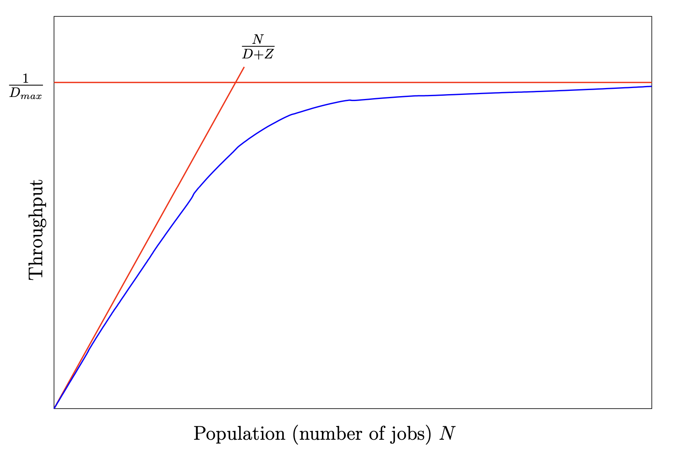

# Bottlenecks and Throughtput Bounds

Since \\( U_k = D_k X \\) and \\( U_k \\le 1 \\), then we know \\( X \\le {1 \\over D_k} \\) for every node \\( k \\) in the system. From this we get that \\( X \\le {1 \\over D_max} \\) where \\( D_{max} \\) is the maximum of \\( D_k \\).

In a system under heavy load we can say that \\( U_{max} \\approx 1 \\) and \\( X \\approx {1 \\over D_{max}} \\). What this means is that \\( 1 \\over D_{max} \\) is the **upper asymptotic bound on throughput under heavy load**, and the resource with the highest demand \\( D_{max} \\) is the **bottleneck** resource of the system. Note that if the system is open, then \\( \\lambda = X \\) so we also require that \\( \\lambda \\le {1 \\over D_{max}} \\) for the system to be stable.

In a system under light load jobs are never queued and so the average total time they spend at each resource \\( k \\) is just \\( D_k \\) (remember \\( D_k \\) is the product of the average number of visits per job and the average service time at that resource), so we can say that for the entire system the response time \\( R \\) is the sum of all service demands: \\(R = D_1 + D_2 + ... + D_k \\). In a closed system, we can apply this to the response time law:

\\[
\\begin{aligned}
  X &= {N \\over (R + Z)} \\\\
    &= {N \\over (D + Z)}
\\end{aligned}
\\]

where \\( D = D_1 + D_2 + ... + D_k \\). This means that \\( N \\over (D + Z) \\) is the **upper asymptotic bound on throughput under light load**.

Combining these two limits, we can say that in general: \\( X \\le min \\left( {1 \\over D_{max}}, {N \\over (D + Z)} \\right) \\). Note that in an open system we say that \\( Z = 0 \\) but we also recognise that \\( N \\) is not fixed. The bound still applies, however it is not as tight as in a closed system.

When throughput is plotted against the number of jobs, it typically looks like this:

