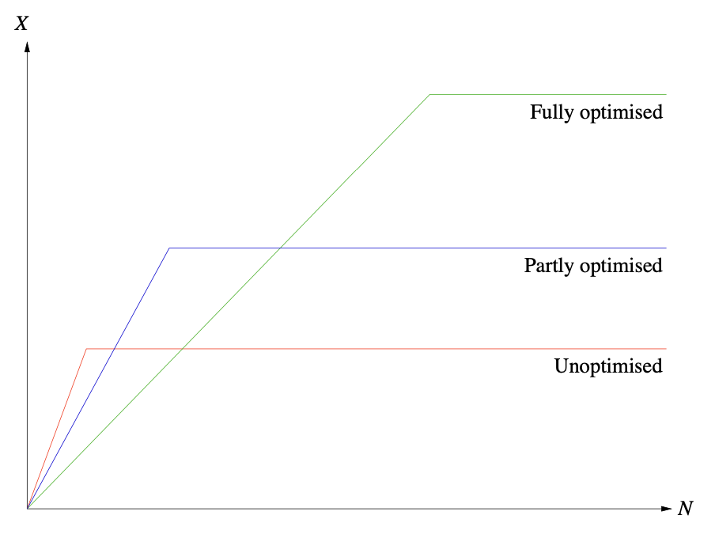
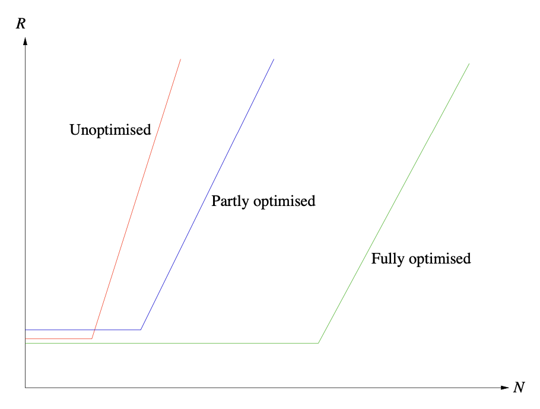

# Performance Optimisation

_Performance optitmisation_ means / involves:

1. Understanding / modelling the system
2. Finding the bottleneck node
3. Fixing the bottleneck

When you fix the bottleneck you change the bounds / limits described in the previous two sections. For example, these two graphs show how optimisations can affect the shape of the throughput \\( X \\) or response time \\( R \\) against number of jobs \\( N \\) plots:

