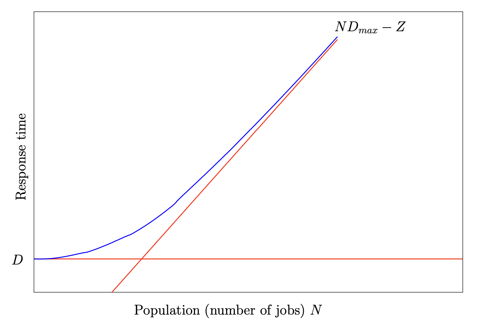

# Response Time Bounds

Just like with throughput, we can calculate the bounds for response time. In a system under high load, since the throughtput is bounded by \\( X \\le {1 \\over D_{max}} \\) we know that:

\\[
\\begin{aligned}
  R &= {N \\over X} - Z \\\\
    &\\le N D_{max} - Z
\\end{aligned}
\\]

In a system under low load, every job experiences the average service demand at each node without needing to queue. That means that the response time is equal to the sum of the service demands \\( D \\), thus \\( R \\ge D \\).

Putting these together we get \\( R \\ge max \\left( D, N * D_{max} - Z \\right) \\). When response time is plotted against number of jobs it looks like:

