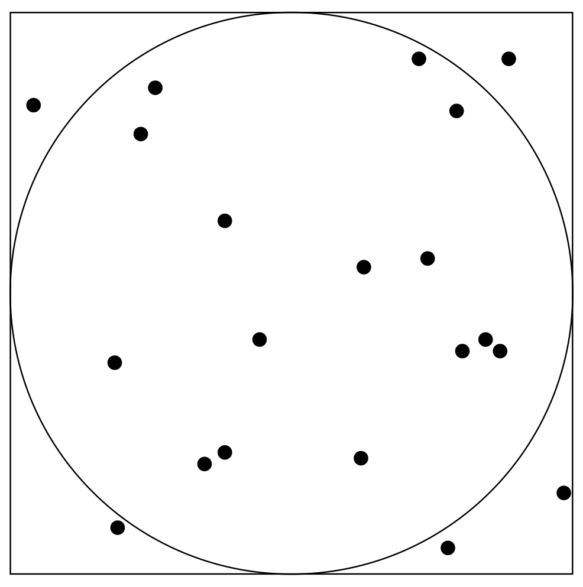

# Simulation

Broadly there are three classes of simulation:

### Monte Carlo

Run multiple 'one shot' experiments using random numbers (no state, just make random observations and repeat many times) and aggregate the results.

For example, \\( \\pi \\) can be estimated using Monte Carlo simulation:

1. Take a circle of radius \\( r \\) and a square with side length \\( 2r \\).
2. Pick random points inside this shape.
3. Calculate `No. in circle / No. in square` to estimate \\( \\pi \\over 4 \\) (by the ratio of the areas \\( \\pi r^2 \\over (2 \\pi)^2 \\) )

### Discrete Time

Given a state transition system (e.g. nodes with arcs) take \\( n \\) steps randomly throught the system, moving from one state to the next in each discrete step. There may or may not be a notion of time in the discrete steps made.

For example, consider a game of Monopoly where you want to find the probability of landing on each board position in the game. This can be done by starting at GO, simulating \\( n \\) dice rolls, following the rules of the game (including chance and community chest cards), and counting how many times each tile is landed on.

### Discrete Event

Similar to discrete time, steps are made through a state transition system, but instead these steps are triggered by discrete events in continuous time.

Using the Monopoly example, to change it from a discrete time simulation to a discrete event simulation we can model the move times explicitly using some random variable \\( T \\) with a specified distribution. Then at each move, we can add to the current time a sample of this distribution to progress through time (e.g. `current time + sample of T`). However if we want to simulate \\( P \\) players who roll their dice independently, we will need to think of a way to resolve the issue of updating time and shared resources (e.g. cards). This can be done using a sequence of move events in time order and controlled access to shared resources (e.g. via queueing).
