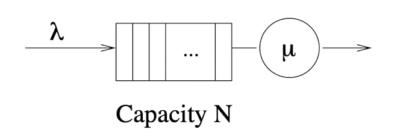
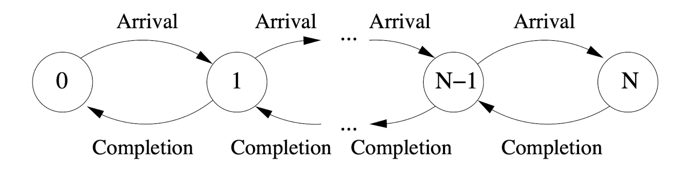
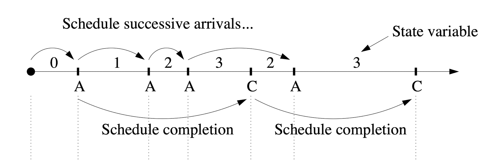
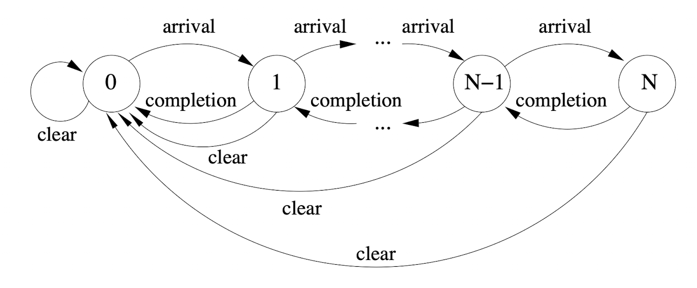

# Example of a Single-server FIFO Queue

Consider a finite single-server queue with a mean interarrival time \\( \\lambda \\), mean service rate \\( \\mu \\), and queue capacity of \\( N \\):



We can model this queue using the following graph, where the number of each state represents the length of the queue:



As shown in this diagram, two events are required to model this queue: `Arrival` and `Completion`.

The timeline priority queue will contain `Arrival` and `Completion` events. Completing each event will update the state depending on the state of the simulation, described by the following rules / pseudocode:

```
Let State = 0
Let N be the max queue length
Let there be a priority queue

Queue an Arrival at the start of the simulation
Get next event in queue

If the event is an Arrival:

  State += 1

  If State < N:
    Queue a new Arrival

  If State == 1:
    Queue a new Completion

If the event is a Completion:

  State -= 1

  If State == N - 1:
    Queue a new Arrival

  If State > 0:
    Queue a new Completion
```

Note that in this example the `Queue` steps implicitly sample the interarrival time for the specific events interarrival time distribution.



Suppose a `Clear` event also needs to be added, which will reset the state to \\( 0 \\). If the state is not equal to \\( 0 \\) then 

```
Queue a Clear at the start of the simulation

If the event is a Clear:

  If state > 0:
    Dequeue the Completion event

  If state == N:
    Queue a new arrival

  State = 0

  Queue a new Clear
```


