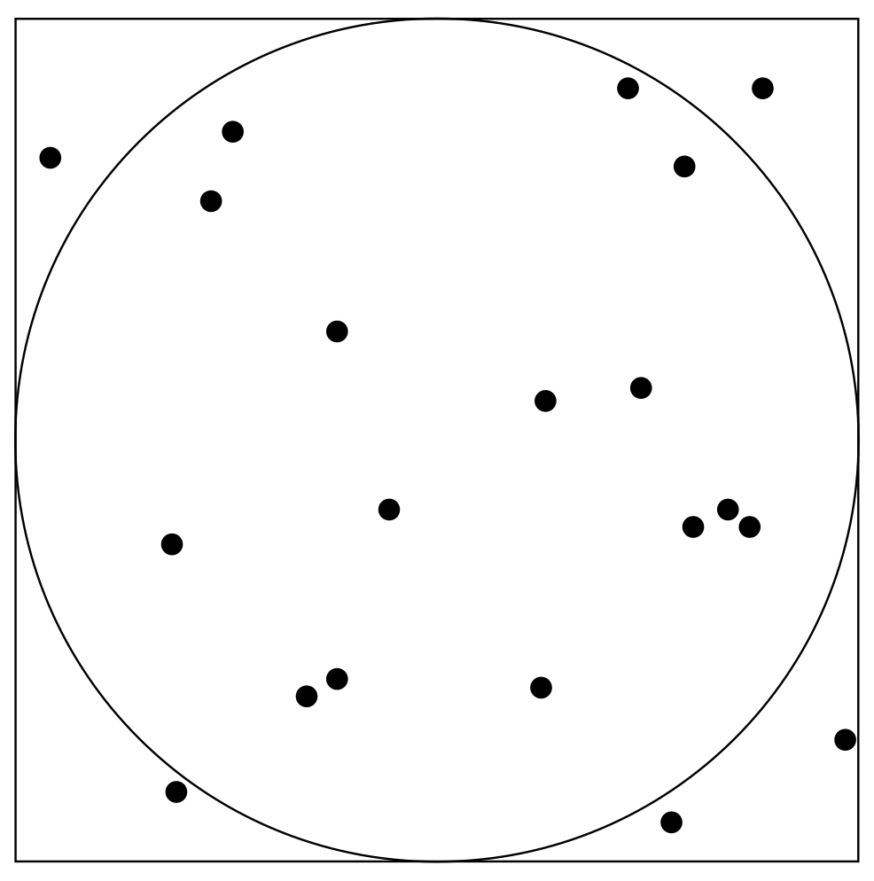

# Monte Carlo

Run multiple 'one shot' experiments using random numbers (no state, just make random observations and repeat many times) and aggregate the results.

For example, \\( \\pi \\) can be estimated using Monte Carlo simulation:

1. Take a circle of radius \\( r \\) and a square with side length \\( 2r \\).
2. Pick random points inside this shape.
3. Calculate `No. in circle / No. in square` to estimate \\( \\pi \\over 4 \\) (by the ratio of the areas \\( \\pi r^2 \\over (2 \\pi)^2 \\) )

